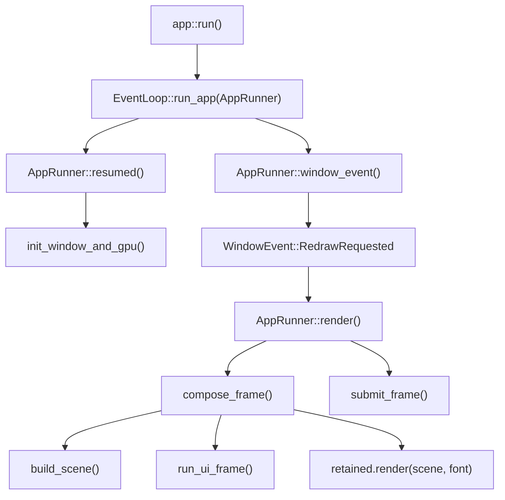
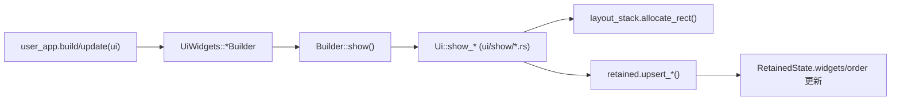
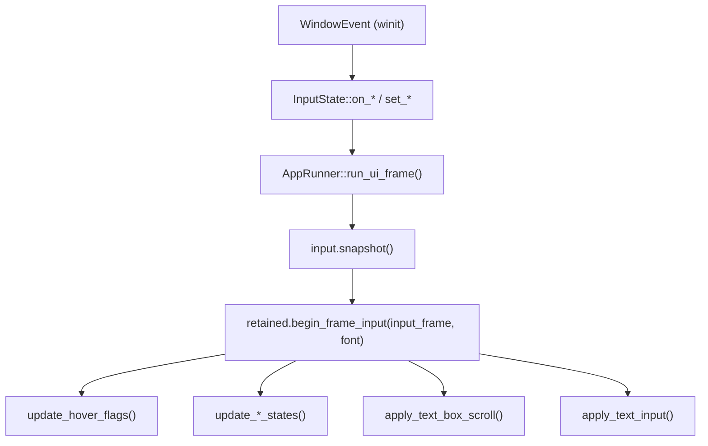
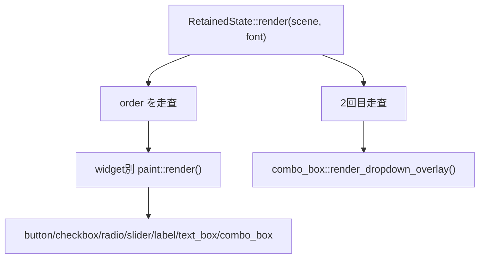
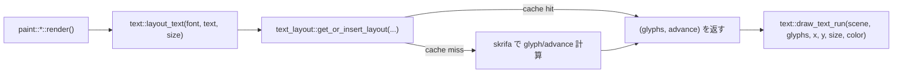
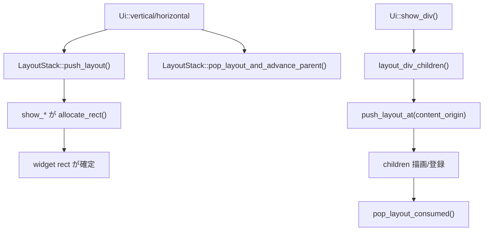
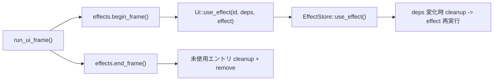
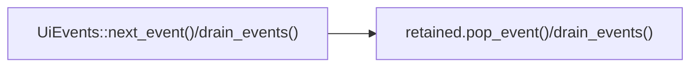

# Runo 関数呼び出し相関図（責務別）

このドキュメントは、`crates/runo_core/src` の主要責務ごとの呼び出し関係を、実装ベースで追いやすくするためのメモです。
対象は「主要ルート」です（全関数を網羅する完全コールグラフではありません）。

## 1. アプリ起動とフレーム進行（`app/`）

主ファイル:
- `crates/runo_core/src/app/mod.rs`
- `crates/runo_core/src/app/events.rs`
- `crates/runo_core/src/app/frame.rs`
- `crates/runo_core/src/app/runner.rs`

## 2. UI 宣言と RetainedState 同期（`ui/`, `ui/show/`, `retained/state/`）

代表例:
- `UiWidgets::button()` → `ButtonBuilder::show()` → `Ui::show_button()` → `retained.upsert_button(...)`
- `UiWidgets::div()` → `DivBuilder::show(f)` → `Ui::show_div()`（子レイアウトを push/pop）

主ファイル:
- `crates/runo_core/src/ui/mod.rs`
- `crates/runo_core/src/ui/widgets.rs`
- `crates/runo_core/src/ui/show/*.rs`
- `crates/runo_core/src/retained/state/*.rs`

## 3. 入力イベント反映（`app/events.rs` → `input.rs` → `retained/input/`）

主ファイル:
- `crates/runo_core/src/app/events.rs`
- `crates/runo_core/src/input.rs`
- `crates/runo_core/src/retained/input/mod.rs`
- `crates/runo_core/src/retained/input/pointer.rs`
- `crates/runo_core/src/retained/input/text_box.rs`

## 4. 描画パイプライン（`retained/paint/`）

補助関数:
- `paint/interaction_color.rs::resolve_interaction_color(...)`
  `enabled > pressed > hovered > default` の共通色選択。

主ファイル:
- `crates/runo_core/src/retained/paint/mod.rs`
- `crates/runo_core/src/retained/paint/*.rs`

## 5. テキスト描画・レイアウト・キャッシュ（`widget/text.rs`, `cache/text_layout.rs`）

主ファイル:
- `crates/runo_core/src/widget/text.rs`
- `crates/runo_core/src/cache/text_layout.rs`

## 6. レイアウト責務（`layout/stack.rs`, `ui/show/div.rs`）

主ファイル:
- `crates/runo_core/src/layout/stack.rs`
- `crates/runo_core/src/layout/div.rs`
- `crates/runo_core/src/ui/show/div.rs`

## 7. Effects とイベント取得（`hooks/effect.rs`, `ui/events.rs`）

主ファイル:
- `crates/runo_core/src/hooks/effect.rs`
- `crates/runo_core/src/ui/events.rs`
- `crates/runo_core/src/retained/state/core.rs`

---

更新ルール（運用メモ）:
- 新規 widget を追加したら、最低でも「2. UI 宣言」「4. 描画」「3. 入力」の図にノードを追記する。
- 共通化（例: `paint` 共通ヘルパー）を入れたら、該当図に共通ノードを追加する。
